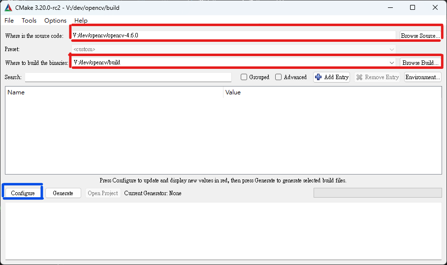
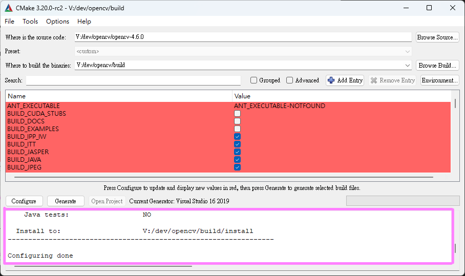
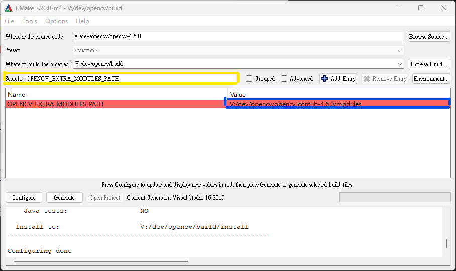
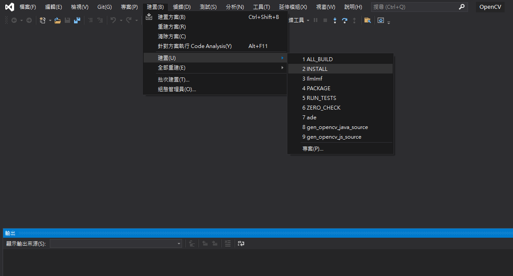

# BRA
> 全名為行為風險評估（behavioral risk assessment），提供了一套管線（pipeline）將作為輸入的影像，轉換為各項評估資料並輸出，目前支援(1).人數(2).社交距離、(3).口罩檢查、(4).清潔行為檢查。

---
## Third Party Reference
+ **[Megvii-BaseDetection](https://github.com/Megvii-BaseDetection) / [YOLOX](https://github.com/Megvii-BaseDetection/YOLOX)**
+ **[ifzhang](https://github.com/ifzhang) / [ByteTrack](https://github.com/ifzhang/ByteTrack)**
+ **[JDAI-CV](https://github.com/JDAI-CV) / [fast-reid](https://github.com/JDAI-CV/fast-reid)**
+ **[NVIDIA-AI-IOT](https://github.com/NVIDIA-AI-IOT) / [torch2trt](https://github.com/NVIDIA-AI-IOT/torch2trt)**

---
## Prerequisites
+ Python >=3.8 `Tested on 3.8 and 3.9`
+ CUDA `Tested on 10.2 and 11.3`
+ FFmpeg or Gstreamer
  
if need
+ TensorRT8 `Tested on v8.2 and v8.4`

---
## Usage Step
#### 1.下載
```bash
git clone --recurse-submodules https://github.com/YyuK-Liao/BRA
```
#### 2.準備Python所需環境
```bash
cd BRA
# 建立一個python虛擬環境
# 「.dev-env」是虛擬環境的名字，可以自己改
python -m venv .dev-env

# 啟用虛擬環境
# windows
.dev-env/Scripts/activate
# GNU/Linux
source .dev-env/bin/activate

# 安裝模組
python -m pip install -r requirement.txt
```
接下來我們必須要安裝pytorch和torchvision，這兩個模組會依賴預安裝的CUDA，如果還沒請[下載](https://developer.nvidia.com/cuda-toolkit-archive)並安裝。
> **WARM:** 請注意，Pytorch並不是每一個版本的CUDA都支援，請先查詢。
> 
確認安裝好後，需要先到[Pytorch](https://pytorch.org/get-started/locally/)或是[Pytorch舊版檔案](https://pytorch.org/get-started/previous-versions/)來查詢安裝指令。請務必根據自己的「作業系統」、「CUDA版本」來進行選擇，「模組管理」這邊使用pip，「語言」請選擇Python。
```bash
# 安裝torch相關模組

# 這邊以非最新版的Pytorch 1.12.1來做示範
# 首先查詢https://pytorch.org/get-started/previous-versions/
# 找到v1.12.1，往下找到Wheel
# 再往下找到你所用的作業系統，這邊選擇Windows
# 在指令區段找到自己CUDA的版本，這邊選擇11.3
# 我們不安裝torchaudio
python -m pip install torch==1.12.1+cu113 torchvision==0.13.1+cu113 --extra-index-url https://download.pytorch.org/whl/cu113
```
<details><summary>為OpenCV啟用Gstreamer（不使用GSTREAMER後端時可以跳過）</summary>

  #### Jetson
  > Jetson系列的開發版都能通過[Install OpenCV 4.5 on Jetson Nano](https://qengineering.eu/install-opencv-4.5-on-jetson-nano.html)的流程來安裝，其中最核心的文件是[OpenCV-4-5-5.sh](https://github.com/Qengineering/Install-OpenCV-Jetson-Nano/raw/main/OpenCV-4-5-5.sh)，也就是該作者些好的編譯腳本。
  
  因此，我們能直接將腳本下載下來，做部分修改就能執行了。
  1. 下載腳本
      ```bash
      wget https://github.com/Qengineering/Install-OpenCV-Jetson-Nano/raw/main/OpenCV-4-5-5.sh
      ```
  2. 我們唯一要修改的東西是`CUDA_ARCH_BIN`參數，他需要根據GPU的架構來填寫，這時我們能夠借助NVIDIA提供的[網站](https://developer.nvidia.com/cuda-gpus#collapseOne)來查詢，Jetson系列可透過「CUDA-Enabled Jetson Products」來查詢，以下是顯示內容：
      |GPU|Compute Capability|
      |---|---|  
      |Jetson AGX Orin, Jetson Orin NX, Jetson Orin Nano|8.7|
      |Jetson AGX Xavier, Jetson Xavier NX|7.2|
      |Jetson TX2|6.2|
      |Jetson Nano|5.3|
      
      換句話說，如果我們的板子是Jetson NX，我們需要將OpenCV-4-5-5.sh中的第58行
      ```bash
       58 -D CUDA_ARCH_BIN=5.3 \
      ```
      改成
      ```bash
       58 -D CUDA_ARCH_BIN=7.2 \
      ```
  3. 修改完成後就能直接執行編譯了
      ```bash
      sudo chmod 755 ./OpenCV-4-5-5.sh
      ./OpenCV-4-5-5.sh
      ```
      確認編譯過程中沒有錯誤就能接著進行下一步了。
  4. 雖然說編譯完後會安裝到某個指定位置的Python裡，但在之後若需要安裝到其他虛擬環境下，雖然可以透過和根環境共享已經安裝的模組，但還是預先打包成wheel會比較方便：
      ```bash
      cd ~/opencv/build/python_loader
      python -m pip wheel .
      ```

  5. 執行指令後會生成兩個.whl的檔案，分別是numpy的和OpenCV的，可以透過以下指令來安裝到虛擬環境：
      ```bash
      source $MY_VENV/bin/activate
      python -m pip install numpy*.whl
      python -m pip install opencv*.whl
      ```

  6. 最後，啟動Python，並寫入`import cv2`來測試，如果安裝正確甚麼都不會返回。

  **Windows:**
  > **WARM:** OpenCV 4.5.5在Windows上編譯Gstreamer功能會出現[問題](https://github.com/opencv/opencv/issues/21393)，目前建議使用4.6.0來編譯。

  > **TIPS:** 除了以下寫出的需要下載和安裝的軟體，在編譯過程我們還會使用到[Visual Studio 2019 with C++](https://my.visualstudio.com/Downloads?q=visual%20studio%202019&wt.mc_id=o~msft~vscom~older-downloads)、[FFmpeg](https://www.gyan.dev/ffmpeg/builds/)(請記得將bin/資料夾加到環境變數Path裡)、[CMake](https://cmake.org/download/)，請自行安裝。
  1. [下載](https://gstreamer.freedesktop.org/download/)並安裝Gstreamer runtime和development。
       > **IMPORTANT:** 請選擇完整安裝。
  2. 下載[OpenCV4.6.0原始碼](https://github.com/opencv/opencv/archive/4.6.0.zip)
  3. 下載[OpenCV_contrib 4.6.0](https://github.com/opencv/opencv_contrib/archive/4.6.0.zip)
  4. 下載[Eigen3.4.0](https://gitlab.com/libeigen/eigen/-/archive/3.4.0/eigen-3.4.0.zip)
  5. 解所有壓縮檔解壓縮，並新建一個`build`資料夾。
  6. 將Gstreamer安裝資料夾底下的`gstreamer\1.0\msvc_x86_64\bin`加入Path變數裡面。
       > **IMPORTANT:** CMake之後會依據用戶的Path來測試，所以優先加入到使用者的Path裡，而不是系統的Path。
  7. 打開CMake-gui，在`Where is the source code`欄位填入解壓縮後的OpenCV資料夾，這邊示範的位置是`V:/dev/opencv/opencv-4.6.0`；在`Where to build the binaries`欄位填入剛剛新建立的build資料夾，這邊示範的位置是`V:/dev/opencv/build`。可參照下圖的紅色標記：
        
  8. 填入後按下上圖藍色的「Configure」，選擇Visual Studio 16 2019並按下Finsh，之後會開始自動檢測環境，等他跑完會產生如下圖中粉紅色框中的資訊：
        
        
      我們需要確認Gstreamer是否被偵測到可以向上拉找到Video I/O的欄位，顯示YES代表偵測到Gstreamer了
        ```bash
        Video I/O:
          DC1394:                      NO
          FFMPEG:                      YES (prebuilt binaries)
            avcodec:                   YES (58.134.100)
            avformat:                  YES (58.76.100)
            avutil:                    YES (56.70.100)
            swscale:                   YES (5.9.100)
            avresample:                YES (4.0.0)
          GStreamer:                   YES (1.20.4)
          DirectShow:                  YES
          Media Foundation:            YES
            DXVA:                      YES
        ```
  9.  接下我們要調整`OPENCV_EXTRA_MODULES_PATH`的參數，我們可以透過如下圖中的黃色框來搜尋，並將我們解壓縮後的contrib資料夾底下的modules的位置填入，如下圖中的藍色框，示範使用的位置為`V:/dev/opencv/opencv_contrib-4.6.0/modules`。
        

      同樣的方法，我們將`EIGEN_INCLUDE_PATH`修改為剛剛解壓縮的eigen 3.4.0資料夾，示範使用的位置是`V:\CppLibrary\eigen-3.4.0`。
      最後將`BUILD_opencv_world`參數啟用，將`BUILD_SHARED_LIBS`參數關閉。
  10.  設定完成後再進行一次configuration，下面的是範例的輸出內容：
        ```bash
        General configuration for OpenCV 4.6.0 =====================================
          Version control:               unknown
        
          Extra modules:
            Location (extra):            V:/dev/opencv/opencv_contrib-4.6.0/modules
            Version control (extra):     unknown
        
          Platform:
            Timestamp:                   2022-12-09T13:06:44Z
            Host:                        Windows 10.0.22623 AMD64
            CMake:                       3.20.0-rc2
            CMake generator:             Visual Studio 16 2019
            CMake build tool:            C:/Program Files (x86)/Microsoft Visual Studio/2019/Community/MSBuild/Current/Bin/MSBuild.exe
            MSVC:                        1929
            Configuration:               Debug Release
        
          CPU/HW features:
            Baseline:                    SSE SSE2 SSE3
              requested:                 SSE3
            Dispatched code generation:  SSE4_1 SSE4_2 FP16 AVX AVX2 AVX512_SKX
              requested:                 SSE4_1 SSE4_2 AVX FP16 AVX2 AVX512_SKX
              SSE4_1 (18 files):         + SSSE3 SSE4_1
              SSE4_2 (2 files):          + SSSE3 SSE4_1 POPCNT SSE4_2
              FP16 (1 files):            + SSSE3 SSE4_1 POPCNT SSE4_2 FP16 AVX
              AVX (5 files):             + SSSE3 SSE4_1 POPCNT SSE4_2 AVX
              AVX2 (33 files):           + SSSE3 SSE4_1 POPCNT SSE4_2 FP16 FMA3 AVX AVX2
              AVX512_SKX (8 files):      + SSSE3 SSE4_1 POPCNT SSE4_2 FP16 FMA3 AVX AVX2 AVX_512F AVX512_COMMON AVX512_SKX
        
          C/C++:
            Built as dynamic libs?:      NO
            C++ standard:                11
            C++ Compiler:                C:/Program Files (x86)/Microsoft Visual Studio/2019/Community/VC/Tools/MSVC/14.29.30133/bin/Hostx64/x64/cl.exe  (ver 19.29.30146.0)
            C++ flags (Release):         /DWIN32 /D_WINDOWS /W4 /GR  /D _CRT_SECURE_NO_DEPRECATE /D _CRT_NONSTDC_NO_DEPRECATE /D _SCL_SECURE_NO_WARNINGS /Gy /bigobj /Oi  /fp:precise     /EHa /wd4127 /wd4251 /wd4324 /wd4275 /wd4512 /wd4589 /MP  /MT /O2 /Ob2 /DNDEBUG 
            C++ flags (Debug):           /DWIN32 /D_WINDOWS /W4 /GR  /D _CRT_SECURE_NO_DEPRECATE /D _CRT_NONSTDC_NO_DEPRECATE /D _SCL_SECURE_NO_WARNINGS /Gy /bigobj /Oi  /fp:precise     /EHa /wd4127 /wd4251 /wd4324 /wd4275 /wd4512 /wd4589 /MP  /MTd /Zi /Ob0 /Od /RTC1 
            C Compiler:                  C:/Program Files (x86)/Microsoft Visual Studio/2019/Community/VC/Tools/MSVC/14.29.30133/bin/Hostx64/x64/cl.exe
            C flags (Release):           /DWIN32 /D_WINDOWS /W3  /D _CRT_SECURE_NO_DEPRECATE /D _CRT_NONSTDC_NO_DEPRECATE /D _SCL_SECURE_NO_WARNINGS /Gy /bigobj /Oi  /fp:precise     /MP   /MT /O2 /Ob2 /DNDEBUG 
            C flags (Debug):             /DWIN32 /D_WINDOWS /W3  /D _CRT_SECURE_NO_DEPRECATE /D _CRT_NONSTDC_NO_DEPRECATE /D _SCL_SECURE_NO_WARNINGS /Gy /bigobj /Oi  /fp:precise     /MP /MTd /Zi /Ob0 /Od /RTC1 
            Linker flags (Release):      /machine:x64  /NODEFAULTLIB:atlthunk.lib /INCREMENTAL:NO  /NODEFAULTLIB:libcmtd.lib /NODEFAULTLIB:libcpmtd.lib /NODEFAULTLIB:msvcrtd.lib
            Linker flags (Debug):        /machine:x64  /NODEFAULTLIB:atlthunk.lib /debug /INCREMENTAL  /NODEFAULTLIB:libcmt.lib /NODEFAULTLIB:libcpmt.lib /NODEFAULTLIB:msvcrt.lib
            ccache:                      NO
            Precompiled headers:         NO
            Extra dependencies:          comctl32 gdi32 ole32 setupapi Iconv::Iconv wsock32 ws2_32
            3rdparty dependencies:       libprotobuf libjpeg-turbo libwebp libpng libtiff libopenjp2 IlmImf zlib quirc ade ittnotify ippiw ippicv
        
          OpenCV modules:
            To be built:                 alphamat aruco barcode bgsegm bioinspired calib3d ccalib core datasets dnn dnn_objdetect dnn_superres dpm face features2d flann fuzzy gapi hfs highgui img_hash imgcodecs imgproc intensity_transform line_descriptor mcc ml objdetect optflow phase_unwrapping photo plot python3 quality rapid reg rgbd saliency shape stereo stitching structured_light superres surface_matching text tracking ts video videoio videostab wechat_qrcode world xfeatures2d ximgproc xobjdetect xphoto
            Disabled:                    -
            Disabled by dependency:      -
            Unavailable:                 cudaarithm cudabgsegm cudacodec cudafeatures2d cudafilters cudaimgproc cudalegacy cudaobjdetect cudaoptflow cudastereo cudawarping cudev cvv freetype hdf java julia matlab ovis python2 python2 sfm viz
            Applications:                tests perf_tests apps
            Documentation:               NO
            Non-free algorithms:         NO
        
          Windows RT support:            NO
        
          GUI: 
            Win32 UI:                    YES
            VTK support:                 NO
        
          Media I/O: 
            ZLib:                        build (ver 1.2.12)
            JPEG:                        build-libjpeg-turbo (ver 2.1.2-62)
            WEBP:                        build (ver encoder: 0x020f)
            PNG:                         build (ver 1.6.37)
            TIFF:                        build (ver 42 - 4.2.0)
            JPEG 2000:                   build (ver 2.4.0)
            OpenEXR:                     build (ver 2.3.0)
            HDR:                         YES
            SUNRASTER:                   YES
            PXM:                         YES
            PFM:                         YES
        
          Video I/O:
            DC1394:                      NO
            FFMPEG:                      YES (prebuilt binaries)
              avcodec:                   YES (58.134.100)
              avformat:                  YES (58.76.100)
              avutil:                    YES (56.70.100)
              swscale:                   YES (5.9.100)
              avresample:                YES (4.0.0)
            GStreamer:                   YES (1.20.4)
            DirectShow:                  YES
            Media Foundation:            YES
              DXVA:                      YES
        
          Parallel framework:            Concurrency
        
          Trace:                         YES (with Intel ITT)
        
          Other third-party libraries:
            Intel IPP:                   2020.0.0 Gold [2020.0.0]
                   at:                   V:/dev/opencv/build/3rdparty/ippicv/ippicv_win/icv
            Intel IPP IW:                sources (2020.0.0)
                      at:                V:/dev/opencv/build/3rdparty/ippicv/ippicv_win/iw
            Lapack:                      NO
            Eigen:                       YES (ver 3.4.0)
            Custom HAL:                  NO
            Protobuf:                    build (3.19.1)
        
          OpenCL:                        YES (NVD3D11)
            Include path:                V:/dev/opencv/opencv-4.6.0/3rdparty/include/opencl/1.2
            Link libraries:              Dynamic load
        
          Python 3:
            Interpreter:                 C:/Program Files/Python39/python.exe (ver 3.9.4)
            Libraries:                   C:/Program Files/Python39/libs/python39.lib (ver 3.9.4)
            numpy:                       C:/Program Files/Python39/lib/site-packages/numpy/core/include (ver 1.23.5)
            install path:                C:/Program Files/Python39/Lib/site-packages/cv2/python-3.9
        
          Python (for build):            C:/Program Files/Python39/python.exe
        
          Java:                          
            ant:                         NO
            JNI:                         NO
            Java wrappers:               NO
            Java tests:                  NO
        
          Install to:                    V:/dev/opencv/build/install
        -----------------------------------------------------------------
        
        Configuring done
        ```

        接著按下Generate，CMake就會開始產生Visual Studio 2019的專案了。

  11.  以系統管理員權限來開啟VS2019，打開在build資料夾底下的`OpenCV.sln`檔案，將專案切換為Release x64模式。只需要再VS2019上方的工具列選擇即可。
  12.  建置方式很簡單，在上方的建置>建置>INSTALL，如下圖：
        
       完成後，如果VS2019上面沒有顯示錯誤就是成功了。
  13.  一旦成功，就可進入`build\python_loader`底下來建立wheel檔案，提供給Python虛擬環境來用了。可以透過如下指令來建立：
        ```bash
        cd V:\dev\opencv\build\python_loader
        python -m pip wheel .
        ```
       執行後，會在`build\python_loader`底下建立`numpy-x.xx.x-cpxx-cpxx-win_amd64.whl`和`opencv-4.6.0-py3-none-any.whl`這兩個wheel檔案，這能直接安裝
       ```bash
       # 啟用python虛擬環境
       python -m pip install numpy-1.23.5-cp39-cp39-win_amd64.whl 
       python -m pip install opencv-4.6.0-py3-none-any.whl
       ```
  14.  經過測試，發現Python3.8以後都會遇到DLL載入[問題](https://github.com/opencv/opencv/issues/17632)，因為Python在Windows上對DLL的載入機制變的更嚴格了，可以參考[Python DOC](https://docs.python.org/3.8/whatsnew/3.8.html#ctypes)；我們需要先透過`os.add_all_dll_directory()`來新增dll資料夾，但這需要修改程式中每一個呼叫`import cv2`的地方，並不是很方便，所幸OpenCV Python Binding有提供應對方案，**那就是修改`lib\site-packages\cv2\__init__.py`中位於第89行的變數`BINARIES_PATHS`**，這裡我們可以加入Gstreamer的bin資料夾，範例中位於`V:\CppLibrary\gstreamer\1.0\msvc_x86_64\bin`：
        ```python
        89     BINARIES_PATHS = [r'V:\CppLibrary\gstreamer\1.0\msvc_x86_64\bin']
        ```
        > **WARM:** 如此一來，只要在此虛擬環境或Python環境的可以直接使用OpenCV了，但每一個建立的虛擬環境都需要重新設定一次。

</details>

#### 3.準備需要的文件
+ 模型的權重
  > 預設的worker/worker3_conf.yaml使用的權重可以直接從這裡來下載。
  > + [bytetrack_m_mot17.pth.tar](https://drive.google.com/file/d/11Zb0NN_Uu7JwUd9e6Nk8o2_EUfxWqsun/view?usp=sharing)
  > + [FMD_m1k.pth](https://drive.google.com/file/d/1qOaoiGO9il8XAiR9j__pJKmISfwWWIf7/view?usp=sharing)
  > + [msmt_sbs_S50.pth](https://github.com/JDAI-CV/fast-reid/releases/download/v0.1.1/msmt_sbs_S50.pth)
  
  完整的下載列表參考（可以根據平台的計算能力來選擇權重）
  + 行人
    + [ByteTrack](https://github.com/ifzhang/ByteTrack/#Model-zoo)
    + [YOLOX](https://github.com/Megvii-BaseDetection/YOLOX/#Benchmark)
  + 口罩（參考資料集：[Face Mask Detection](https://www.kaggle.com/datasets/andrewmvd/face-mask-detection)）
    + [預訓練YOLOX-m](https://drive.google.com/file/d/1qOaoiGO9il8XAiR9j__pJKmISfwWWIf7/view?usp=sharing)
    + [預訓練YOLOX-nano](https://drive.google.com/file/d/1gyzccGYATmPAnF8SiT8_Qe-twUd56ki4/view?usp=sharing)
    + 使用tools/train.py來訓練，可參考exps/FaceMask_nano.py來訓練COCO格式的資料、參考exps/FaceMask_m.py來訓練VOC格式的資料，更詳細的訓練步驟可參考[YOLOX/train_custom_data.md](https://github.com/Megvii-BaseDetection/YOLOX/blob/main/docs/train_custom_data.md)。
  + reid
    + [fast-reid](https://github.com/JDAI-CV/fast-reid/blob/master/MODEL_ZOO.md/#MSMT17-Baseline)
+ view-config
  > 設定文件可參考work/xxx_conf.yaml，記錄了計算社交距離所需要的座標轉換參數，以及清潔行為檢查事先做的設定，包含定義區域、定義檢查時長。
  
  這份設定文件可以透過tools/IConFiguration.py來進行設定，操作步驟可參考[這裡](view_config.md)。
+ worker-config
  > 設定文件可參考worker/worker3_conf.yaml，記錄了worker需要的參數，包含了主要管線的各式開關參數，以及模型或演算法所需參數、權重檔案等。

  這份設定檔案需要手動撰寫，建議複製worker/worker3_conf.yaml後再修改：
  ```bash
  cp worker/worker3_conf.yaml worker/custom_worker_conf.yaml
  vim worker/custom_worker_conf.yaml
  ```

#### 3.EX 如果需要TensorRT
<details><summary>[詳細]</summary>

  > 要以TensorRT來執行BRA的推論工作的話，需要TensorRT Python API和torch2trt的python模組。
  
  TensorRT的安裝教學可以直接參考[NVIDIA DOCUMENT](https://docs.nvidia.com/deeplearning/tensorrt/install-guide/index.html)；若是使用Jetson，安裝JetPack即可，JetPack已經附帶了包含TensorRT在內的相關資料，但若需要以不同於JetPac自帶的Python版本的話，需要重新對TensorRT做跨語言的API綁定，具體流程可參考[這裡](https://github.com/mlcommons/inference_results_v2.0/issues/2#issuecomment-1133845520)和[這裡](https://github.com/NVIDIA/TensorRT/tree/main/python)
  ```bash
  export EXT_PATH=~/external
  mkdir -p $EXT_PATH && cd $EXT_PATH
  git clone https://github.com/pybind/pybind11.git -b v2.6.2 --depth=1

  # python原始碼可以從https://www.python.org/downloads/source/ 找
  # 或是用以下的指令來下載，3.x.y需替換成現在用的版本
  wget https://www.python.org/ftp/python/3.x.y/Python-3.x.y.tgz
  tar xvzf Python-3.x.y.tgz
  mkdir python3.x
  cp -r Python-3.x.t/Include/ python3.x/include
  # 如果沒有的話，可以用find指令來找pyconfig.h
  cp /usr/include/aarch64-linux-gnu/python3.x/pyconfig.h python3.8/include/

  # 複製TensorRT OSS，版本和內建JetPack的TensorRT版本一樣就好了
  git clone https://github.com/NVIDIA/TensorRT -b X.Y.Z --depth=1
  cd TensorRT/python
  # 直接執行build.sh即可建立.whl檔案
  # 需要確認一下參數有沒有起作用，沒作用的話可以先編輯build.sh
  CPATH=$EXT_PATH/pybind11/include TRT_OSSPATH=$EXT_PATH/TensorRT \
  PYTHON_MAJOR_VERSION=3 PYTHON_MINOR_VERSION=8 TARGET=aarch64 \
  ./build.sh
  # 如果編譯過程有跳缺少標頭檔的錯誤。可以先用find指令來找，在複製進TensorRT/include對應的資料夾底下，再重新執行build.sh

  # 需要先啟動python虛擬環境在安裝
  python -m pip install build/dist/tensorrt-*.whl

  # 可以使用python import來測試
  python -c "import tensorrt"
  ```
  確認TensorRT Python API後就可以安裝torch2trt了，這邊提醒一點，目前測試下來 **[NVIDIA-AI-IOT](https://github.com/NVIDIA-AI-IOT) / [torch2trt@5405207](https://github.com/NVIDIA-AI-IOT/torch2trt/tree/540520700f969e13b921be1bb944c44d299ff406)** 不支持對YOLOX進行動態batch_size的轉換，建議使用 **[jaybdub](https://github.com/jaybdub) / [torch2trt@tensor_shape_support](https://github.com/jaybdub/torch2trt/tree/tensor_shape_support)**，python模組安裝流程如下：
  ```bash
  # 老樣子，需要先啟動python的虛擬環境
  git clone -b tensor_shape_support --depth=1 https://github.com/jaybdub/torch2trt
  cd torch2trt
  python ./setup.py install
  ```
  確認所有工具鏈都安裝好後，就可以透過tools/trt.py來對YOLOX模型進行轉換
  ```bash
  # 啟動python的虛擬環境
  # 要注意的是-C 並不會幫忙創建資料夾，需要手動建立
  python ./tools/trt.py -f $EXP位置 -c $權重位置 -b $最大批次大小 -P $生成檔案的前綴名稱 -C 儲存資料夾 -w 工作區域大小
  # 工作區域大小是1的向左偏移數量，也就是說30是1G=1<<30，32是4G
  # 最後會在儲存資料夾底下生成兩個檔案，分別為前綴.engine和前綴.pth
  # engine是給原始的tensorrt模組調用的，pth是給torch2trt調用的，torch2trt可以保證推論流程和pytorch一樣
  ```

  除了手動以tools/trt.py來生成trt檔案外，系統有提供動態生成的機制，這也是為甚麼worker/worker3_conf.yaml中有`trt_batch: 16`和`trt_workspace: 34`這兩個參數，他們分別代表了上例中的`-b`和`-w`參數，不過檔案名稱將會是worker/worker3_conf.yaml中的`trt_path`參數插入hostname，不過不需要額外修改`trt_path`，讀取時會自動判斷。

  > **NOTE:** trt engine都是完全依賴環境的，一旦環境有變動，例如變更硬體，這份資料需要重新生成，也因此這份資料不能事先生成再遷移。
</details>

#### 4.執行
```bash
cd work
python ./work_dev.py $ARGS
```
ARGS的選項有很多，我們可以類型來分類，其中「*」代表必填
##### + 輸入輸出
||短前綴|長前綴|參數|意義|
|------|------|------|------|------|
|*|-vin |--video_input  |輸入源||
||-vout|--video_output |輸出源||
||-s   |--output_scale |(寬度):(長度)|輸出的影像尺寸，使用-1可以自斷推斷|
||-so  |--stream_output|串流輸出源||
||-csv |--write_to_csv |用來儲存每個時間的計算結果的csv檔||

##### + 日誌
||短前綴|長前綴|參數|意義|
|------|------|------|------|------|
||-vlog|--vout_log|輸出源日誌檔案||
||-slog|--stream_log|串流輸出源日誌檔案||

##### + 流程的控制參數
||短前綴|長前綴|參數|意義|
|------|------|------|------|------|
|||--legacy||只處理一次輸入源就結束|
||-b   |--batch_size   |最大的一次執行批次數 ||
||-fps |--fps          |浮點數               |預設是從輸入源的header||
||-ss  |--start_second |hh:mm:ss.ms 或秒數   |輸入源的起始位置||
||-d   |--duration     |hh:mm:ss.ms 或秒數   |預計的處理長度||

##### + 需要的設定檔
||短前綴|長前綴|參數|意義|
|------|------|------|------|------|
|*|-vc  |--view_config|view_config設定文件||
|*|-wc  |--worker_config|worker_config設定文件||
||-worker|--worker_file|worker文件|默認是使用worker/worker3.py||

##### + 其他
||短前綴|長前綴|參數|意義|
|------|------|------|------|------|
||-en|--output_encoder|ffmpeg編碼器|可以使用`ffmpeg -codecs`來查詢|
|||--log_level|ERROR、WARN、INFO、DEBUG、TRACE|work的輸出日誌層級|
|||--io_backend|FFMPEG、GSTREAMER|輸入和輸出所要使用的後端|
||-h|--help||列出所有參數|

##### 最簡單的範例
```bash
# 記得啟動python的虛擬環境
cd work
python ./work_dev.py -vin 輸入影像 -wc work-config -vc view-config --legacy
```
上面這段指令會等輸入影像執行完就結束，但由於沒有指令輸出的相關參數，所以並不會儲存任何資料。

```bash
# 記得啟動python的虛擬環境
cd work
python ./work_dev.py -vin 輸入影像 -vout 輸出影像 -csv CSV檔案 -wc work-config -vc view-config --legacy
```
這段則會額外將輸出渲染成輸出影像，默認通過FFmpeg使用h264_nvenc編碼，日誌存在默認的當前工作資料夾下的work/video_storing.log；同時會輸出兩份CSV檔案，分別是按幀的原始資料，以及每1分鐘處理過的資料。

```bash
# 記得啟動python的虛擬環境
cd work
python ./work_dev.py -vin 輸入影像 -vout 輸出影像 -csv CSV檔案 -wc work-config -vc view-config -fps 15 -b 16 -d 00:02:00 --legacy
```
這段指定了批次大小，能一次執行多張影像；同時還指定了處理時間，這裡希望處理兩分鐘長度的影像後就結束；指定了fps代表原始的輸入影像所提供的fps資訊不准，手動告知程式。

假如使用FFmpeg時需要不同的編碼器，可能是機器不支援h264_nvenc，或是希望使用其他編碼方式，我們可以通過ffmpeg指令來查詢
```bash
ffmpeg -codecs | grep "編碼方式"

# 以h265來舉例
ffmpeg -codecs | grep "hevc"
# powershell可使用
ffmpeg -codecs | Select-String "hevc"
# 輸出
 DEV.L. hevc                 H.265 / HEVC (High Efficiency Video Coding) (decoders: hevc hevc_qsv hevc_cuvid )
 (encoders: libx265 hevc_amf hevc_mf hevc_nvenc hevc_qsv )
# 這代表我的機器支援的h265編碼器有libx265、hevc_amf、hevc_mf、hevc_nvenc hevc_qsv
```
透過指定`-en`或`--output_encoder`參數就能指定編碼器了
```bash
# 記得啟動python的虛擬環境
cd work
python ./work_dev.py -vin 輸入影像 -vout 輸出影像 -csv CSV檔案 -wc work-config -vc view-config -fps 15 -b 16 -d 00:02:00 -en hevc_nvenc --legacy
```
這次我們使用了h265的編碼方式，同樣使用NVIDIA的GPU上的硬體加速來進行編碼。

> **WARN:** `-en`參數所指定的編碼器是FFMPEG和GSTREAMER共用的參數，只會被使用於輸出，換句話說，我們只能選擇`--io_backend`所指定的後端類型所提供的編碼器，舉例來說FFmpeg中的`libx264`相對於Gstreamer的`x264enc`編碼器。

可以發現上面所有的例子都有一個參數`--legacy`，這代表系統只會處理一次輸入，當輸入源錯誤的話則會報錯；相反的，若取消`--legacy`參數，系統將會持續嘗試訪問輸入源，不僅如此，當輸入源從可以訪問到不能訪問，系統仍會持續等待，這種模式能搭配串流輸入源來使用，一旦接收到輸入源便會開始處理，一旦接收不到輸入源便會儲存這一輪的處理資料，並等待下一輪的輸入
```bash
# 記得啟動python的虛擬環境
cd work
python ./work_dev.py -vin rtmp://server_ip:1935/channel -vout 輸出影像前綴 -csv CSV檔案前綴 -wc work-config -vc view-config -fps 15 -b 16 -d 00:02:00 -en hevc_nvenc
```
這個例子中，我們移除了`--legacy`參數，輸入源改成rtmp的串流源，程式會以輪詢的方式向多媒體伺服器請求。
> **WARN:** `-vout`和`-csv`參數的意義在非legacy模式中已經變成前綴，在處理完一輪後，系統會以這個前綴加上日期時間以及副檔名來儲存資料。

##### 特殊輸入
在之前的範例我們不是使用本地的影像資源，就是拉取網路上的串流來運算，但其實支援的輸入類型不只如此，我們還支援了攝影機的影像，或是一條包含影像處理行為的pipeline，這才是我們使用Gstreamer的主要原因。

當我們需要使用攝影機時，我可以直接修改`--video_input`參數為一個像機讀取的pipeline：
```bash
# GUN/Linux下讀取USB攝影機
python ./work_dev.py -vin "v4l2src device=/dev/video0 ! video/x-raw, width=1920, height=1080 ! videoconvert ! appsink" --io_backend GSTREAMER ...

# Windows下讀取USB攝影機
python ./work_dev.py -vin "ksvideosrc device-index=0 ! video/x-raw, width=1920, height=1080 ! videoconvert ! appsink" --io_backend GSTREAMER ...

# Jetson上讀取CSI MIPI攝影機
python ./work_dev.py -vin "nvarguscamerasrc sensor_id=0 ! video/x-raw(memory:NVMM), width=3264, height=2464, format=NV12, framerate=21/1 ! nvvidconv ! videoconvert ! appsink" --io_backend GSTREAMER ...
```

三個環境中讀取攝影機的方法其實各個都是一條pipeline description，因此，我們當然能進行而外的影像處理，舉例來說，如果我們攝影機的像素太低，我們可以直接將pipeline改成：
```bash
# GUN/Linux下讀取USB攝影機
python ./work_dev.py -vin "v4l2src device=/dev/video0 ! video/x-raw, width=640, height=480 ! videoscale ! video/x-raw,width=1920 ! videoconvert ! appsink" --io_backend GSTREAMER ...
```
pipeline相較之前，這次我們使用640寬480高的攝影機，由於太小，我們取出後按比例將寬放大到1920，最後才會輸入程式。