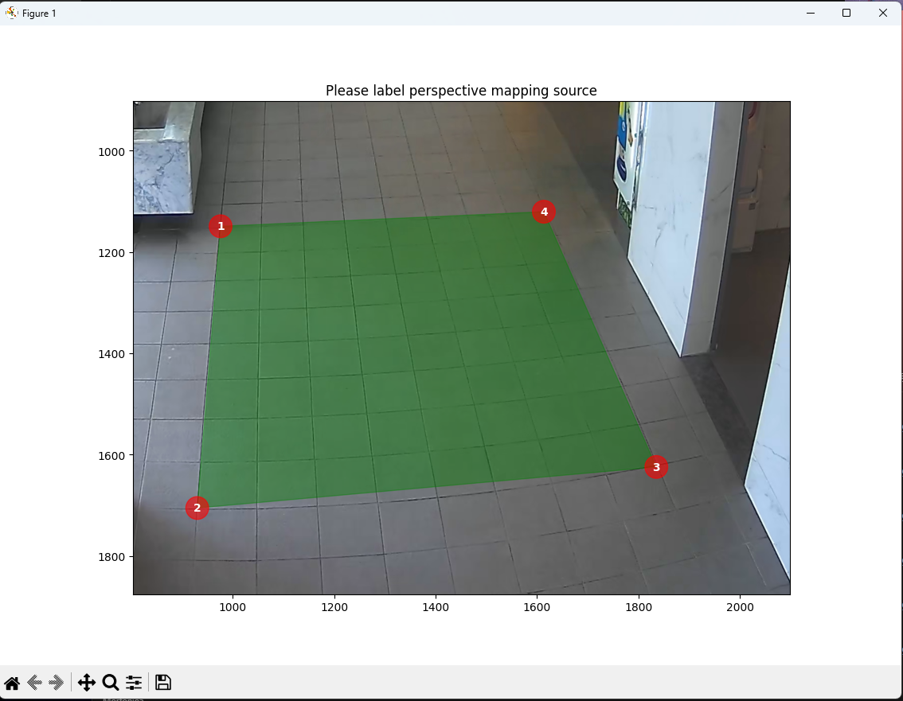
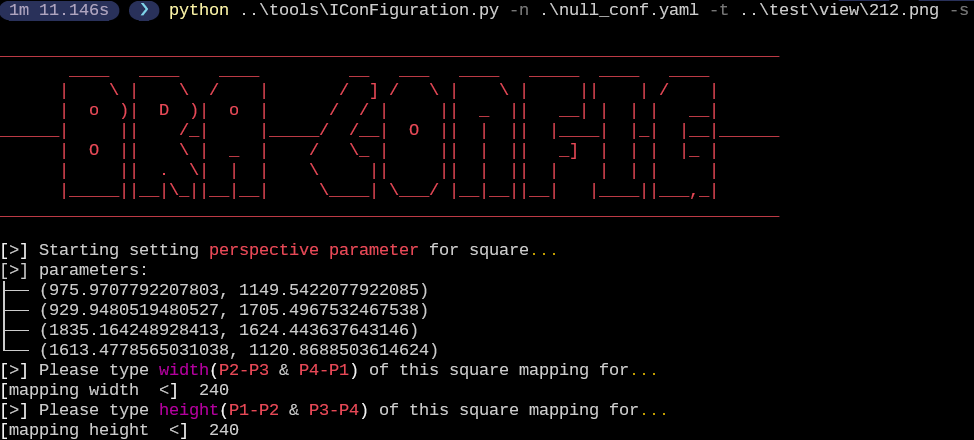
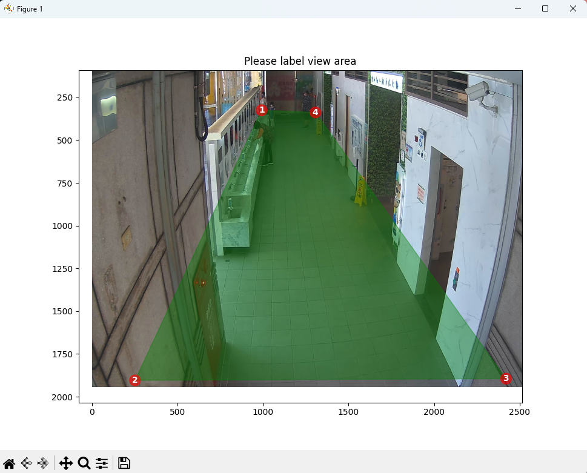
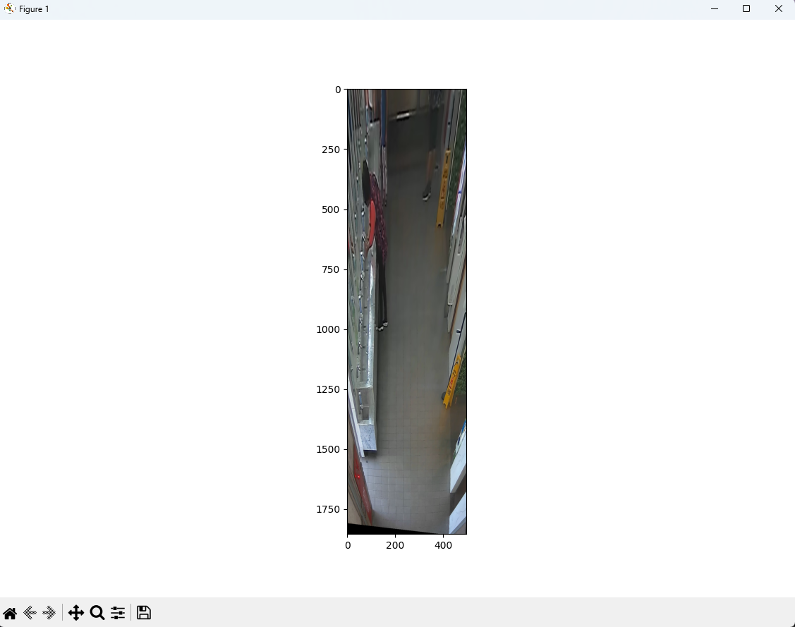
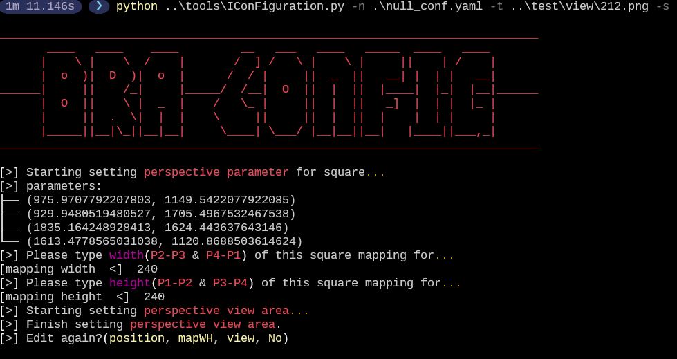
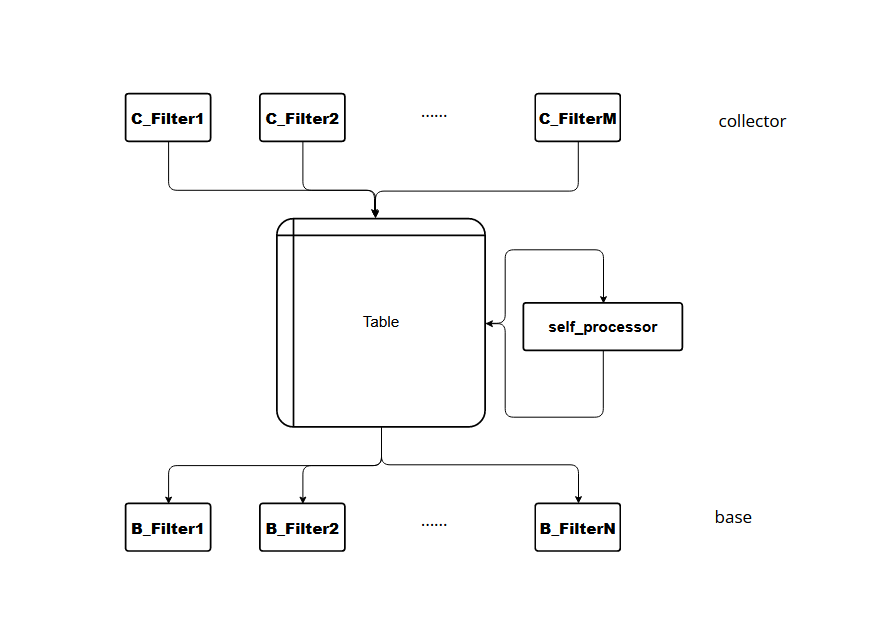
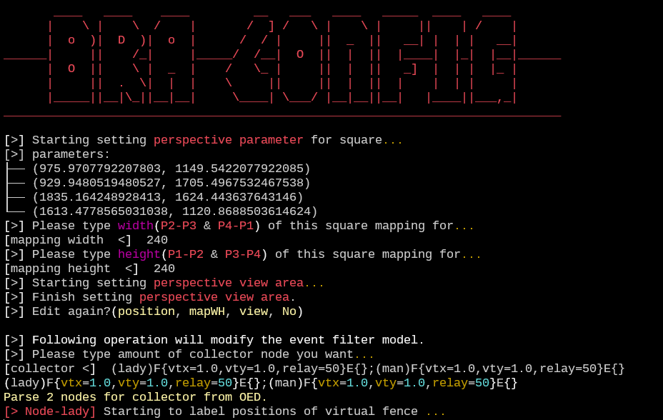
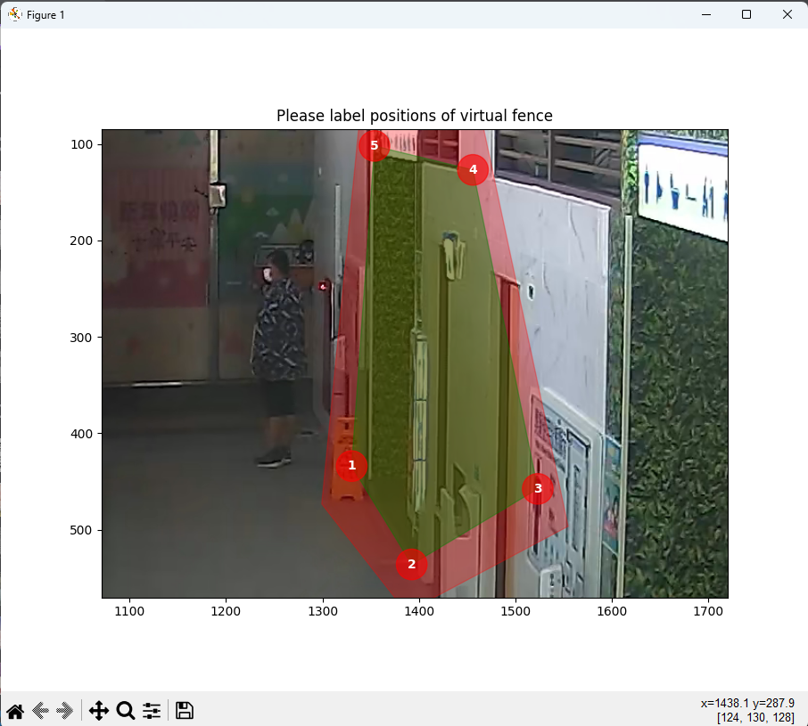
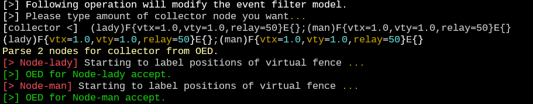
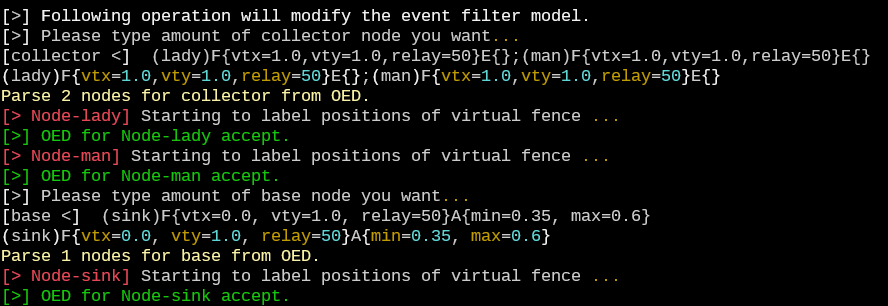

## View Configuration步驟
> 設定文件可參考work/xxx_conf.yaml，記錄了計算社交距離所需要的座標轉換參數，以及清潔行為檢查事先做的設定，包含定義區域、定義檢查時長。

設定文件可以透過tools/IConFiguration.py來進行設定
```bash
# 請記得先啟動Python虛擬環境
python ./tools/IConFiguration.py -n 設定檔名稱 -t 目標影像 -s
```
##### 參數意義為
|短前綴|長前綴|參數|意義|
|------|------|------|------|
|-n|--name|設定檔名稱|要新增的設定檔，或要修改的設定檔|
|-t|--target |目標影像|用來輔助互動的影像，只能為單張畫面|
|-s|--setting ||設定模式|

##### 執行畫面
1. 一開始，會跳出視窗來詢問標註投影點的原始座標。完成後關閉視窗即可
   > 左鍵標點；右鍵刪除上一個點；滾輪向上放大；滾輪向下縮小
   
   

    > **NOTE:** BRA指使用簡單的四點矩形投影來模擬出俯視圖（Bird Eyes View），因此規定了標註順序須為逆時針如上圖。

    > **WARN:** 若要求高準度的投影，還須考慮到相機的廣角變形，需要額外做處理。
2. 接下來會詢問駐點的物理資訊
   > 依序輸入寬度和高度即可，一般建議物理上一公分就輸入1，這樣計算出的投影距離可以取1px為1公分。

   
3. 接著詢問感興趣的區域，標註出地板資訊即可
   > 左鍵標點；右鍵刪除上一個點；滾輪向上放大；滾輪向下縮小

   

   > **NOTE:** 計算上採用四點矩形來計算偏移量，因此只允許標註4點。

   完成標註後，會自動顯示感興趣區域的投影結果。

   
4. 投影部分結束前會再詢問是否修改
   > position對應步驟1，mapWH對應步驟2，view對應步驟3，不輸入則為No

   

---

在進入事件過濾器設定之前，有必要先弄懂BRA中所定義的事件過濾模型

> **NOTE:** 之後的步驟都跟事件過濾有關，也就是洗手等移動狀態變化的偵測。



設計上有參考三極管，因此以集極（collector）和基極（base）來命名過濾器。
邏輯上可以認為集極過濾器面對所有的輸入資訊來做過濾，在BRA中可以過濾出諸如進出門或廁所的行人，這些過濾出了資料會記錄在表中；狀態是隨時間變化的，因此記錄在表中的狀態會由自處理器來隨時間變更狀態；基極則負責將表中的資料過濾出完成感興趣事項的目標，在BRA中可以過濾出洗手完成或消毒完成，當然也會過濾超時不感興趣的資料。

上圖的每個Filter其實都可以由多個過濾器組成，在BRA中一般稱這些組合為node或是trigger，所以除了基本的輪詢單個過濾器的方式，BRA額外提供了「單行事件描述」(OED, One-line Events Description)來提供多trigger的解析，OED範例如下
```
(name1)F{vtx=1, vty=1, relay=0}E{}A{min=0, max=1};(name2)F{vtx=1, vty=1, relay=50}E{}A{min=0, max=1};
```
上面這句OED代表了兩個分別名為name1和name2的trigger，name1由三個過濾器組成，這三個也是目前BRA實作的三種過濾器：F代表Fence，可以過濾目標物件是否到達某個區域，其中vtx、vty是目標物件的感興趣位置，是根據`(Ix, Iy)=(C0x + vtx*w, C0y + vty*h)`來換算anchor的，而relay則是定義ROI區域的外擴幅度，主要效果是離開ROI會以外擴區域為主，進入則不變；E代表Edge，只會過濾出前面過濾器的負向變動狀態，有點像是負緣觸發，舉例來說，如果前面過濾器是偵測目標進到某個區域內，那後面接的Edge過濾器將會在目標從區域內出來時啟動，如果他配Fence的relay屬性，能容許物件辨識造成的偏移影響Edge過濾器的效果；A代表Attribute，概念很簡單，就是直接過濾掉屬性不符合的目標，舉例來說，BRA會以Attribute過濾器過濾掉小於min屬性或大於max屬性長寬比的物件。再來的name2則和name1一樣，由相同的過濾器組成，只差在屬性不同。

> **NOTE:** 兩個trigger間建議使用分號「;」分開，不加或使用其他符號也行，只要不與trigger主要的語法衝突到即可。

---
這邊說明使用OED的設定流程
1. 設定集極
   > 這邊的提示字代表集極的trigger數量，是留給基礎的輪詢用的；此時輸入OED語法可直接一次性新增集極的所有trigger。

   

   `(lady)F{vtx=1.0, vty=1.0, relay=50}E{};(man)F{vtx=1.0, vty=1.0 ,relay=50}E{}`範例中，我們設定集極由兩個trigger組成，每個trigger都是由一個對目標右下點感興趣且擴張50px的Fence和一個Edge組成。
2. 設定集極的補充資訊
   > 若OED沒有寫出過濾器的屬性，且這些屬性是必要的，程式會再度詢問這些屬性；當然也有不能由OED寫出的屬性，向Fence的position屬性就需要由GUI來補充設定。

   

    GUI設定Fence的position屬性和標註投影座標的操作一樣，但是不會限制標駐點的數量；此外，還可以注意到標註點生成的平面有兩個顏色，綠色代表原始的標註平面，紅色是擴張50px的平面。

   
   
   完全設定好後，集極的所有設定就完成了。
3. 設定基極
   > 基極的設定步驟和集極一模一樣。

   範例`(sink)F{vtx=0.0, vty=1.0, relay=50}A{min=0.35, max=0.6}`
   

> **NOTE:** 不管事輪詢和OED都一樣，後面的流程是事件的閥值設定。

4. 閥值設定
   > 有三種閥值需要設定，分別是target、nonTarget、waiting，分別代表積極過濾後經過多長時間代表完成、進入表後經過多少時間未觸發基極代表失敗、積極過濾後經過多長時間代表未完成。

   

4. 事件設定結束前會再詢問是否修改
   > event對應步驟1，threshold對應步驟2，不輸入則為No

    這步驟結束後就是真正的完成了view-config的設定，會在`name`參數所指定的位置生成一份設定檔。

> **NOTE:** 如果需要修改設定檔也可以直接以tools/IConFiguration.py來編輯。

> **NOTE:** 範例生成的null_conf.yaml也可以在work/中找到。